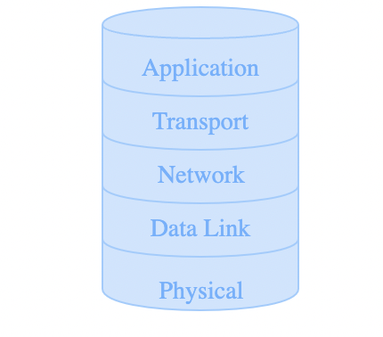
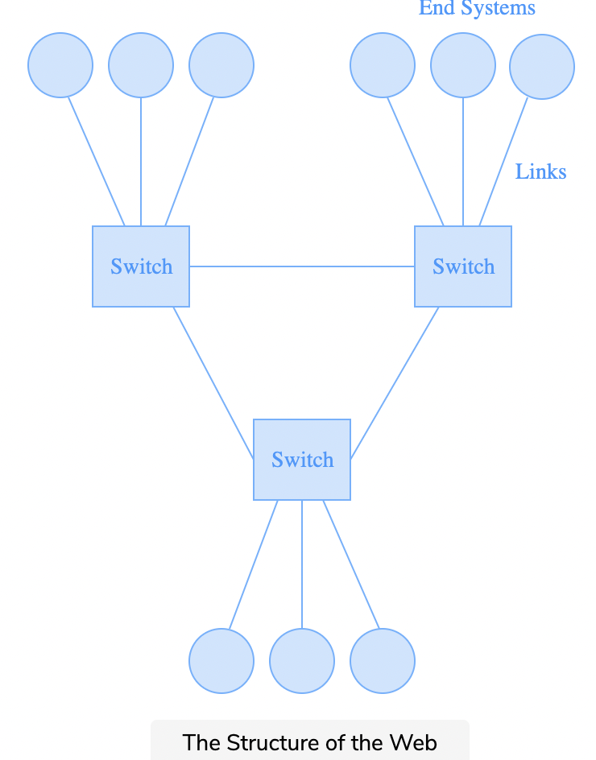
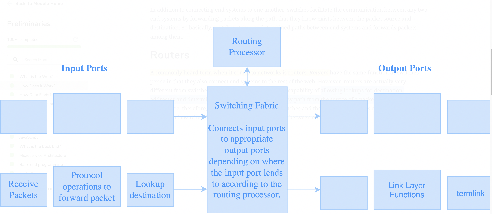
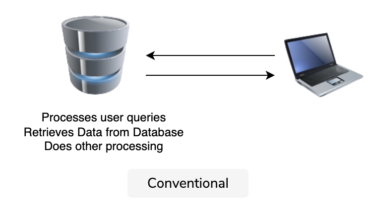
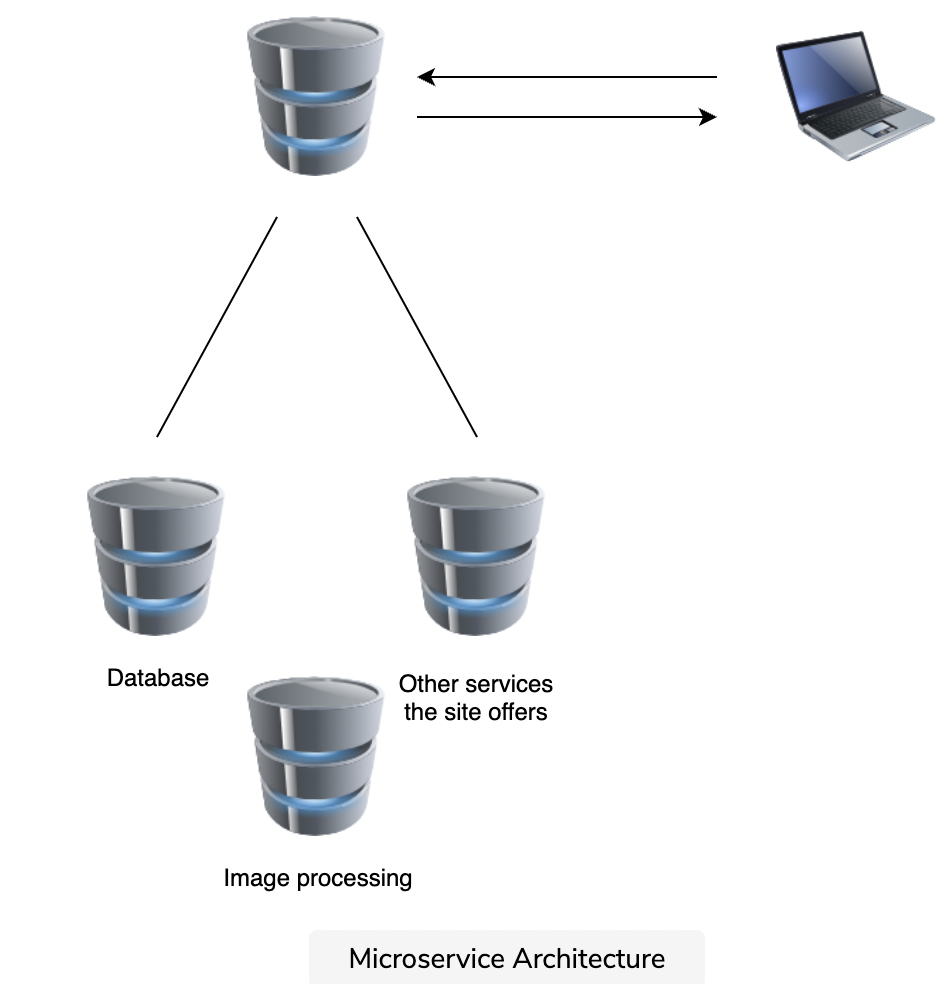

# Notes-Educative

 What is the Web?

* The web is **network** which connects devices together and allows them to communicate.

* Web is a ***subset*** of the internet

* The term **internet** is actually the global network of servers that actually make information sharing possible.

* Websites on the internet are hosted on **servers** while the way that it is accessed is through a browser which is called the **client**.

## Layers

>  
---

### Network Layer
* It is responisible for connecting two machines on the internet

### Physical Layer
* The wiring of the machine so that the machine can be available on the internet

### Data-Link Layer
* It is resposible for transferring data between two machines 

### Transport Layer
* Responsible for connecting applications onto the internet 

### Application Layer
* Where the application is built.

---

# How does it Work?


## Switches
* The internet is comprimised of devices called switches that connect the end systems (your computer) to every other device on the network.
* These end systems are connected through links. 
* In addition switches allow users to communciate with each other through forwarding packages.  

> 

## Routers

* Routers also connect end users to the internet, however they have the additional capacity to allow the lookup of the desination as well as determeining the shortest path from the packet source to the end user.

> 
## Data Packets
* The data is divided into smaller chunks called packets, and then the packets are sent to the destination independently.
* This is because large data may get corrupted.

---
## TCP -> Transport Layer
* Is a transport layer which ensures the data is reliable
* Done by adding additional packets in the data for authentication 

---
## HTTPS and HTTP -> Application Layer
* HTTP -> Hyper Text Transfer Protocol-> inside the application layer
* HTTP is built on top of the TCP, which means that HTTP will make sure that the data is authenticated. 

* HTTP -> HyperText Transfer Protocol Secure-> a secure version of HTTP-> no third parties have access to the data. 

## Ports
* Ports are where message arrive on the end-system
* The Port number for HTTP is 80-> which means that every message you send on http leaves from port 80, every message that you resevice is on port 80.

* Ports above 1024 are open ports which are avaiable to programmers, and is used in socket programming 

---
# Internet Protocall (IP) -> Network Layer
* Internet protocol is a network layer which is responsible for assigning addresses to devices. 
* Each device on the internet has a unquie identifer 
* Once you have a website users are able to connect to it through the IP address of the server 
* Routers do not store the URLs of every website stored on the internet, since they only need the IP address.
* However users only know the URLs of these websites.
* To bridge this gap **DNS servers** are used which is a server which looks up a URL and responds with an IP address called a **DNS resolution**.
``` linux
    ifconfig
```

## Client Side
* What the website looks like for a user
* How it requests data from a server

## Server Side
* Used to deliver information that is queried from the website
* Server-Side languages use Javascript, Python, PHP, Ruby, C#

# Back End

## Web Servers
* A Web server delivers content and services to users
* They are exactly like normal computers but do not have monintors, and can only be connected through **SSH** which is a way to get into another machine's terminal through your own.
* Web servers also have operating systems like Linux

## Mircroservices
* The websites dont actually exist on one server, but exist on virtual machines which which allow us to have different operating systems on on machine.
> 
*The picture above is when one server should be used for all sorts of different data processing*

> 
*What actually happens*
